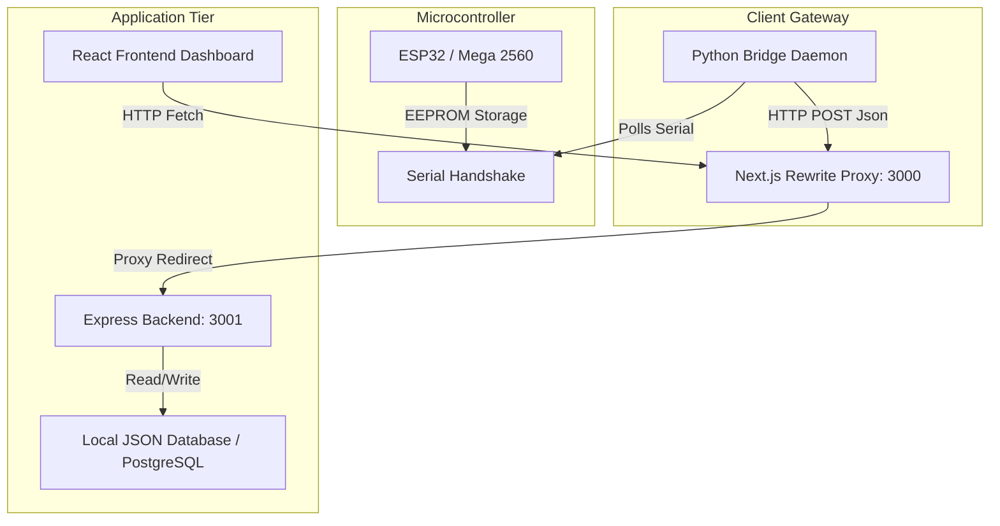

# System Architecture Specification

This document details the architectural design, communication interfaces, and security protocols for the **Temporal Clinical Reasoning Engine (TCRE) Glucometer System**.

---

## 1. Architectural System Design

The system follows a decoupled, three-tier IoT architecture:
1. **IoT / Embedded Tier**: Physical microcontroller (Mega 2560 / ESP32) storing clinical readings in local EEPROM, communicating over serial.
2. **Gateway Tier**: Python `TCRE_Device_Manager` running locally to poll serial inputs and relay JSON records to the REST API.
3. **Application Tier**: Standalone Express API backend serving database queries, and Next.js frontend serving the dashboard visualization.

---

## 2. Telemetry and Upload Data Flow

The flow of records from the patient's device to the dashboard:
1. **Trigger**: The clinician clicks "Import from Device" on the Dashboard.
2. **Activation**: Frontend calls `POST /api/device/trigger` which sets `importRequested: true` in backend volatile memory.
3. **Polling**: The Python bridge daemon is polling `GET /api/device/status` every 1 second. It notices `importRequested` is `true`.
4. **Acquisition**: Python bridge sends `READ` command via serial to ESP32. ESP32 dumps EEPROM lines.
5. **Validation**: Python bridge validates CRC and patient record formats.
6. **Ingestion**: Python bridge posts the JSON array to `POST /api/device/upload` (via port 3000 -> proxy 3001).
7. **Persistence**: Express backend ingests the array, filters out duplicates, updates `patient_db.json` and logs audit events.
8. **Clearing**: Python bridge calls `POST /api/device/status` with `status: "Completed"` and `arduinoCleared: true` and sends `CLEAR` to ESP32 to empty EEPROM.
9. **Display**: Frontend notices state change to "Completed" and pulls fresh records from `/api/patients`.

---

## 3. Security Boundaries & Controls

To support compliance in future commercial deployments, the following boundaries are established:
- **CORS Policies**: Express backend restricts cross-origin request sources specifically to the frontend domain.
- **Proxy Gateway**: The Next.js server proxies API routes. Direct backend ports are blocked to outside traffic, leaving only Next.js (port 443 HTTPS) exposed.
- **Input Validation**: Backend enforces strict array checking and parameter casting to prevent injection attacks or JSON directory traversals.
- **Data Encryption**: All data in transit utilizes TLS (HTTPS/WSS). Future PostgreSQL migration will enforce encryption at rest (AES-256).
