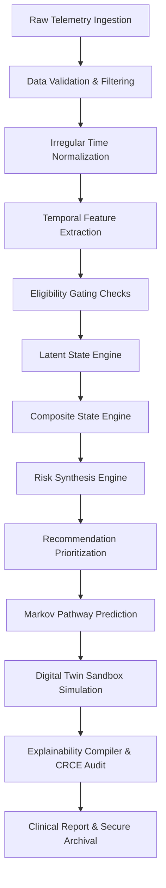

# TEMPORAL CLINICAL REASONING ENGINE (TCRE)
## CLINICAL ENGINE PIPELINE MATHEMATICAL & LOGICAL SPECIFICATION

---

### DOCUMENT METADATA SHEET

*   **Document Title:** Temporal Clinical Reasoning Engine (TCRE) Clinical Engine Pipeline Mathematical & Logical Specification
*   **Document Type:** Patent-Grade Clinical Reasoning Specification & Engineering Monograph
*   **System Version:** 2.1.0
*   **Status:** Frozen Reference Specification
*   **Classification:** Restrictive / Clinical Engineering Internal
*   **Target Audience:** Clinical Data Scientists, Systems Engineers, Patent Examiners, Medical CDSS Auditors

---

## 1. OVERALL PROCESSING PIPELINE

### 1.1 Architectural Philosophy and Pipeline Dataflow
The Temporal Clinical Reasoning Engine (TCRE) is a deterministic, rule-based clinical decision support system (CDSS) designed to transform longitudinal physiological biomarker telemetry into clinical recommendations, trajectory predictions, and explainable justifications. 

In safety-critical clinical environments, standard probabilistic classifiers and deep learning systems operate as "black boxes," introducing systemic risks such as uninterpretable transitions, hallucinated alerts, and a lack of auditability. The TCRE mitigates these issues by utilizing a pipeline of deterministic, closed-form mathematical operators and explicit Boolean logic gates. This ensures that identical input telemetry streams always produce identical clinical outputs.

The end-to-end dataflow of the TCRE follows a unidirectional sequence of twelve processing stages:



### 1.2 Pipeline Stage Specifications

#### Stage 1: Raw Telemetry Ingestion
*   **Purpose:** Ingest raw, timestamped physiological readings from continuous monitoring devices or manual logs.
*   **Inputs:** A sequence of raw measurements $M_{raw} = \{(t_i, y_i)\}$.
*   **Outputs:** Chronologically sorted telemetry set $M$.
*   **Responsibilities:** Establish a clean, chronologically ordered time-series.
*   **Workflow:** Read input data, parse ISO 8601 timestamps into epoch seconds, and sort the array such that $t_0 < t_1 < \dots < t_{N-1}$.
*   **Failure Modes:** Out-of-order timestamps, incomplete JSON/CSV payloads.
*   **Boundary Conditions:** Rejects empty datasets.
*   **Design Considerations:** Ensure millisecond precision in sorting when multiple readings occur within the same minute.
*   **Assumptions:** The telemetry source represents a single patient's continuous longitudinal record.
*   **Transition:** Passes sorted telemetry to the Data Validation stage.

#### Stage 2: Data Validation & Filtering
*   **Purpose:** Filter out corrupt sensor readings, duplicate entries, and extreme outliers.
*   **Inputs:** Chronologically sorted telemetry set $M$.
*   **Outputs:** Validated telemetry set $M_{valid}$.
*   **Responsibilities:** Maintain numerical integrity and prevent sensor errors from corrupting downstream calculations.
*   **Workflow:** Check each reading $y_i$ against physical boundary limits (e.g., $50 \le y_i \le 600$ mg/dL for blood glucose). Filter out duplicate timestamps by preserving the first occurrence.
*   **Failure Modes:** Sensor calibration drift passing through standard checks.
*   **Boundary Conditions:** Rejects individual values outside $[50, 600]$ mg/dL. If more than 50% of the readings in a window are invalid, flags a system validation error.
*   **Design Considerations:** Outlier limits must be configurable based on the target biomarker.
*   **Assumptions:** Extreme values outside bounds represent physical sensor disconnection or reading errors rather than true physiology.
*   **Transition:** Passes validated telemetry to Time Normalization.

#### Stage 3: Irregular Time Normalization
*   **Purpose:** Normalize non-uniformly spaced measurements to support daily-interval trend analysis.
*   **Inputs:** Validated telemetry set $M_{valid}$.
*   **Outputs:** Daily mean averages $\bar{y}_d$ and spacing parameters.
*   **Responsibilities:** Calculate baseline drifts independent of sampling frequency variations.
*   **Workflow:** Compute consecutive time differences $\Delta t_i = t_i - t_{i-1}$. Map readings to discrete daily bins $d$ and compute the arithmetic daily averages.
*   **Failure Modes:** Large multi-day data gaps causing division errors or empty daily bins.
*   **Boundary Conditions:** If a day contains zero readings, the engine marks it as a gap and does not interpolate to avoid injecting artificial signals.
*   **Design Considerations:** Irregular sampling must not bias daily averages (e.g., overnight gaps vs. postprandial clustering).
*   **Assumptions:** Physiological baselines change at a scale measurable in days.
*   **Transition:** Passes daily averages to Feature Extraction.

#### Stage 4: Temporal Feature Extraction
*   **Purpose:** Extract rates of change, volatility, baseline deviations, cumulative burden, and data density indices.
*   **Inputs:** Daily averages $\bar{y}_d$ and validated telemetry $M_{valid}$.
*   **Outputs:** A set of six normalized temporal indices: Velocity (VI), Acceleration (AI), Volatility (VOL), Baseline Deviation (BDI), Cumulative Burden (CBI), and State Confidence (SCI).
*   **Responsibilities:** Quantify the dynamic characteristics of the biomarker signal.
*   **Workflow:** Compute linear regression slopes over rolling windows, calculate root-mean-square errors of residuals, integrate hyperglycemic burden, and evaluate data completeness.
*   **Failure Modes:** Rolling windows containing fewer than 3 valid daily averages.
*   **Boundary Conditions:** Clamps raw indices to $[0, 100]$ before applying scaling factors.
*   **Design Considerations:** Normalization functions must use predefined multipliers to map raw clinical values to a unified index space.
*   **Assumptions:** The chosen rolling window (e.g., 5 days) is long enough to filter noise but short enough to capture acute trends.
*   **Transition:** Passes indices to Eligibility Gating.

#### Stage 5: Eligibility Gating Checks
*   **Purpose:** Audit the data density and span to confirm the patient profile contains sufficient information to execute reasoning rules.
*   **Inputs:** Temporal indices and telemetry metadata.
*   **Outputs:** Eligibility flags and warning arrays.
*   **Responsibilities:** Prevent sparse data from triggering false-positive alerts.
*   **Workflow:** Check if the total observation span $D \ge 5$ days and the average sampling density $\rho \ge 3$ readings/day.
*   **Failure Modes:** Sparse monitoring profiles bypassing checks due to local data clustering.
*   **Boundary Conditions:** If $D < 2$ days, the engine blocks all downstream reasoning. If $2 \le D < 5$ days, the engine executes with low-confidence overrides.
*   **Design Considerations:** Thresholds must be adjustable for different monitoring devices (e.g., CGM vs. fingerstick).
*   **Assumptions:** Data quality indices are stable across the observation window.
*   **Transition:** Passes validated indices and eligibility flags to the Latent State Engine.

#### Stage 6: Latent State Engine
*   **Purpose:** Calculate the activation scores and status vectors of the eight primary latent clinical states.
*   **Inputs:** Normalized temporal indices and eligibility flags.
*   **Outputs:** Latent state scores and status vectors.
*   **Responsibilities:** Classify specific physiological indicators (e.g., Silent Deterioration, High Variability).
*   **Workflow:** Evaluate Boolean pre-conditions for each state. If gates are met, compute the state score as a weighted sum of temporal indices.
*   **Failure Modes:** Conflicting state criteria (e.g., simultaneously active recovery and deterioration states).
*   **Boundary Conditions:** State scores are clamped to $[0, 100]$. Eligibility failures force states to safe defaults ($\le 15$).
*   **Design Considerations:** Decouple gating thresholds from calculation logic.
*   **Assumptions:** Latent states represent distinct, independent physiological patterns.
*   **Transition:** Passes latent state vectors to the Composite State Engine.

#### Stage 7: Composite State Engine
*   **Purpose:** Identify high-order interactions and clinical crises resulting from the coupling of multiple active latent states.
*   **Inputs:** Latent state scores, trends, and monitoring durations.
*   **Outputs:** Composite state activation status, scores, and persistence counters.
*   **Responsibilities:** Detect dangerous multi-state conditions (e.g., Emerging Crisis, Hidden Escalation).
*   **Workflow:** Evaluate multi-state Boolean coupling rules, check persistence thresholds, and compute composite scores.
*   **Failure Modes:** Persistence timers resetting incorrectly due to isolated missing readings.
*   **Boundary Conditions:** Requires minimum persistence durations (e.g., $\ge 3$ days for Emerging Crisis, $\ge 14$ days for Chronic Crisis) before activation.
*   **Design Considerations:** Model state interactions using logical gates and persistence timers.
*   **Assumptions:** Coupled states carry significantly higher risk than isolated latent states.
*   **Transition:** Passes latent and composite state structures to the Risk Synthesis Engine.

#### Stage 8: Risk Synthesis Engine
*   **Purpose:** Calculate a unified, calibrated metabolic risk score representing the patient's overall clinical urgency.
*   **Inputs:** Temporal indices, latent states, and composite states.
*   **Outputs:** Synthesized TCRE Risk Score ($Risk_{final}$), Risk Tier, and Risk Trend.
*   **Responsibilities:** Provide a single, validated metric representing clinical risk.
*   **Workflow:** Compute a weighted sum of primary metrics, calibrate using the State Confidence Index, and apply composite state risk amplification.
*   **Failure Modes:** Floating-point rounding errors pushing the final score out of bounds.
*   **Boundary Conditions:** Clamped strictly to $[0, 100]$.
*   **Design Considerations:** Ensure risk weights sum to $1.0$ at the raw synthesis level.
*   **Assumptions:** The selected weights reflect clinical risk priorities.
*   **Transition:** Passes risk metrics to the Recommendation Prioritization stage.

#### Stage 9: Recommendation Prioritization
*   **Purpose:** Map active clinical states and risk tiers to prioritized clinician guidelines.
*   **Inputs:** Latent states, composite states, and final risk score.
*   **Outputs:** Prioritized recommendation array.
*   **Responsibilities:** Provide actionable decision support.
*   **Workflow:** Filter guideline databases, sort by priority tiers (URGENT, PRIMARY, SECONDARY, SUPPORTING), and apply priority suppression rules.
*   **Failure Modes:** Contradictory recommendations (e.g., simultaneous dose titration and de-escalation).
*   **Boundary Conditions:** If $Risk_{final} \ge 76$, the engine automatically suppresses low-priority guidelines and overrides the primary recommendation slot with urgent escalation directives.
*   **Design Considerations:** Ensure recommendation mapping is deterministic.
*   **Assumptions:** Clinicians use recommendations as advisory inputs rather than automated prescriptions.
*   **Transition:** Passes current recommendations to the Prediction Engine.

#### Stage 10: Prediction Engine
*   **Purpose:** Project future physiological pathways and calculate guideline confidence decay over a forecast horizon.
*   **Inputs:** Current temporal indices, risk scores, and recommendations.
*   **Outputs:** Trajectory pathway probabilities and forecast guidelines.
*   **Responsibilities:** Provide proactive, short-term clinical forecasts.
*   **Workflow:** Calculate Markov transition probabilities, simulate trajectory scenarios, and decay forecast recommendation confidence over time.
*   **Failure Modes:** Probabilities failing to sum to $1.0$ due to rounding errors.
*   **Boundary Conditions:** Clamps probabilities strictly to $[0.05, 0.90]$ to reflect clinical uncertainty.
*   **Design Considerations:** Forecast timelines must be clearly separated from current diagnostic states.
*   **Assumptions:** Physiological state transitions behave as a discrete Markov process over short horizons.
*   **Transition:** Passes projections to the Digital Twin Sandbox.

#### Stage 11: Digital Twin Sandbox Simulation
*   **Purpose:** Simulate patient physiological responses under hypothetical intervention scenarios.
*   **Inputs:** Current diagnostic state and scenario definitions.
*   **Outputs:** Simulated risk profiles, utility scores, and intervention rankings.
*   **Responsibilities:** Allow clinicians to evaluate alternative treatment strategies.
*   **Workflow:** Apply scenario multipliers to baseline indices, recalculate the TCRE pipeline, compute weighted utility scores, and rank outcomes.
*   **Failure Modes:** Parameter leakage mutating the patient's actual historical record.
*   **Boundary Conditions:** Simulations are isolated in memory and destroyed upon session termination.
*   **Design Considerations:** Deep-copy baseline states before applying simulation multipliers.
*   **Assumptions:** Simulated multipliers represent achievable clinical targets.
*   **Transition:** Passes simulated profiles to the Explainability Compiler.

#### Stage 12: Explainability Compiler & CRCE Audit
*   **Purpose:** Generate mathematical justifications, compile clinical narratives, and validate logic consistency in real-time.
*   **Inputs:** Telemetry database, diagnostic results, and predictions.
*   **Outputs:** Audit logs, narrative summaries, and CRCE validation reports.
*   **Responsibilities:** Ensure system transparency, safety, and traceability.
*   **Workflow:** Run the Clinical Rule Consistency Engine (CRCE) across 8 consistency checks. If passed, compile explanation narratives and write execution snapshots to read-only logs.
*   **Failure Modes:** Validator bypass or stack overflow during recursive dependency checks.
*   **Boundary Conditions:** If CRCE compliance score falls below 95%, the engine blocks report release.
*   **Design Considerations:** All calculations must run synchronously to preserve trace completeness.
*   **Assumptions:** Auditors require access to intermediate variables and active gating conditions.
*   **Transition:** Archives the validated report in history and displays it on the clinician dashboard.

---

## 2. INPUT DATA

### 2.1 Telemetry Parameters
The primary input to the TCRE is a discrete, chronologically ordered sequence of biomarker measurements. In the baseline verification embodiment, this telemetry represents blood glucose readings:
*   **Measurement Value ($y_i$):** Represents the biomarker concentration, measured in mg/dL.
*   **Timestamp ($t_i$):** Represents the exact time of the reading, parsed and stored as standard Unix epoch seconds (seconds elapsed since January 1, 1970).
*   **Source:** A metadata string indicating the origin of the reading (`manual` log entry, `csv_upload`, or `system` automated device import).

### 2.2 Data Constraints and Ingestion Rules
To ensure mathematical stability, the ingestion layer enforces several strict data constraints:
1.  **Chronological Ordering:** Measurements must be sorted in strictly ascending chronological order:
    $$t_0 < t_1 < \dots < t_{N-1}$$
2.  **Physical Boundary Validation:** Each measurement value $y_i$ is validated against defined physical limits:
    $$50 \le y_i \le 600\text{ mg/dL}$$
    Values outside this range are rejected as sensor errors.
3.  **Duplicate Filtering:** If multiple records contain identical timestamps, the engine preserves the first occurrence and discards duplicates to prevent zero-interval time deltas ($\Delta t_i = 0$), which would cause division-by-zero errors in rate calculations.

### 2.3 Clinical Reference Targets
The reasoning rules are evaluated relative to two established clinical reference thresholds:
*   **Target Baseline ($T$):** The physiological midpoint representing optimal fasting homeostatic control. For blood glucose, this is configured as:
    $$T = 110\text{ mg/dL}$$
*   **Hyperglycemic Limit ($H$):** The boundary marking the onset of acute or chronic tissue damage. For blood glucose, this is configured as:
    $$H = 140\text{ mg/dL}$$

---

## 3. TIME NORMALIZATION

### 3.1 Handling Irregular Sampling Intervals
Continuous clinical telemetry is rarely spaced uniformly. Standard sensors may drop packets, patients may miss fingerstick readings, or devices may stop recording during sleep. The TCRE handles this non-uniform spacing by calculating time differences between consecutive readings:
$$\Delta t_i = t_i - t_{i-1},\quad i \in [1, N-1]$$

### 3.2 Observation Span and Sampling Density
The total observation window span $D$ in days is computed by comparing the first and last timestamps in the active telemetry set:
$$D = \frac{t_{N-1} - t_0}{86400}$$

Using the span $D$ and total measurement count $N$, the average sampling density $\rho$ (readings per day) is computed as:
$$\rho = \frac{N}{\max(D, 1.0)}$$

### 3.3 Data Sparsity and Gaps
If $\rho < 3$ readings/day, the engine flags a data sparsity warning. In cases of severe gaps (e.g., $\Delta t_i > 48$ hours), the engine marks the gap in the timeline and logs a warning:
$$\text{"Telemetry is sparse. Gaps may mask peak readings."}$$

This data quality auditing is critical because sparse data can artificially lower volatility calculations and cause cumulative burden estimates to be underestimated.

---

## 4. EVERY DERIVED FEATURE

The TCRE calculates six primary temporal features, mapping raw values to a normalized $[0, 100]$ index space.

### 4.1 Velocity Index (VI)
*   **Clinical Goal:** Measure the rate of change of the patient's physiological baseline.
*   **Formula:**
    $$\bar{y}_d = \frac{1}{M_d} \sum_{k=1}^{M_d} y_{d,k}$$
    $$S = \frac{\sum_{d=1}^K (d - \bar{d})(\bar{y}_d - \bar{y})}{\sum_{d=1}^K (d - \bar{d})^2}$$
    $$VI_{raw} = \text{clamp}\left(\text{round}\left((S + 5.0) \times 8.0\right),\, 0,\, 100\right)$$
    $$VI_{norm} = \text{round}\left(VI_{raw} \times 0.90\right)$$
    where $\bar{y}_d$ is the average biomarker value on day $d$, $M_d$ is the number of readings on day $d$, $S$ is the slope of the linear regression fit over a rolling window of $K$ days, $\bar{d}$ is the mean day index, and $\bar{y}$ is the mean daily average.
*   **Interpretation:** A positive slope ($S > 0$) represents a creeping upward trend; a negative slope ($S < 0$) represents a downward trend.
*   **Safety Safeguards:** The regression slope $S$ is restricted to $[-5.0, 7.5]$ mg/dL/day before mapping, preventing extreme outliers from skewing velocity indices.

### 4.2 Acceleration Index (AI)
*   **Clinical Goal:** Measure the change in baseline velocity over time (velocity derivatives).
*   **Formula:**
    $$AI_{raw} = \text{clamp}\left(\text{round}\left(50.0 + S \times 4.0\right),\, 0,\, 100\right)$$
    $$AI_{norm} = \text{round}\left(AI_{raw} \times 0.88\right)$$
    where $S$ is the linear regression slope.
*   **Interpretation:** Values $> 50$ represent accelerating baseline trends; values $< 50$ represent decelerating trends.

### 4.3 Volatility Index (VOL)
*   **Clinical Goal:** Quantify glycemic instability and rapid oscillations, independent of overall baseline trend drifts.
*   **Formula:**
    $$\hat{y}_i = S \cdot t_i + C$$
    $$RMSE = \sqrt{\frac{1}{N}\sum_{i=0}^{N-1} (y_i - \hat{y}_i)^2}$$
    $$VOL_{raw} = \text{clamp}\left(\text{round}\left(\frac{RMSE}{40} \times 100\right),\, 0,\, 100\right)$$
    $$VOL_{norm} = \text{round}\left(VOL_{raw} \times 0.90\right)$$
    where $\hat{y}_i$ represents the predicted value from the linear trend regression, and $RMSE$ is the root-mean-square error of the residuals.
*   **Interpretation:** Higher values represent severe volatility and instability; lower values represent stable baseline control.

### 4.4 Baseline Deviation Index (BDI)
*   **Clinical Goal:** Measure the distance between the patient's average biomarker value and the target fasting baseline.
*   **Formula:**
    $$\mu = \frac{1}{N}\sum_{i=0}^{N-1} y_i$$
    $$BDI_{raw} = \text{clamp}\left(\text{round}\left(\frac{|\mu - T|}{100} \times 100\right),\, 0,\, 100\right)$$
    $$BDI_{norm} = \text{round}\left(BDI_{raw} \times 0.92\right)$$
    where $\mu$ is the overall average biomarker value, and $T = 110$ mg/dL is the target baseline.
*   **Interpretation:** Represents the offset of the patient's average glucose from target healthy ranges.

### 4.5 Cumulative Burden Index (CBI)
*   **Clinical Goal:** Measure cumulative exposure to toxic biomarker concentrations above target thresholds.
*   **Formula:**
    $$HyperSum = \sum_{y_i > 140} (y_i - 140)$$
    $$CBI_{raw} = \text{clamp}\left(\text{round}\left(\frac{HyperSum}{N \times 20} \times 100\right),\, 0,\, 100\right)$$
    $$CBI_{norm} = \text{round}\left(CBI_{raw} \times 0.85\right)$$
    where $HyperSum$ integrates all readings that exceed the clinical limit of $140$ mg/dL.
*   **Interpretation:** High values indicate sustained, long-term exposure to hyperglycemic concentrations.

### 4.6 State Confidence Index (SCI)
*   **Clinical Goal:** Quantify telemetry data completeness and confidence based on observation duration and sampling frequency.
*   **Formula:**
    $$Ratio = \text{clamp}\left(\frac{N}{D \times 3},\, 0,\, 1.2\right)$$
    $$SCI_{raw} = \text{clamp}\left(\text{round}\left(40.0 + Ratio \times 50.0 + \min(10, N)\right),\, 0,\, 100\right)$$
    $$SCI_{norm} = \text{round}\left(SCI_{raw} \times 0.98\right)$$
    where $Ratio$ compares actual measurements to target daily readings over the observation span $D$.
*   **Interpretation:** Measures data completeness. High values ensure sufficient density for clinical rule validation.

### 4.7 Mathematical Normalization Rationale
Swapping raw biomarker values directly into clinical reasoning rules would break biomarker independence. The TCRE resolves this by mapping all raw values to normalized indices using specific scaling constants:
$$\Lambda = \{\lambda_{VI}=0.90,\, \lambda_{AI}=0.88,\, \lambda_{VOL}=0.90,\, \lambda_{BDI}=0.92,\, \lambda_{CBI}=0.85,\, \lambda_{SCI}=0.98\}$$

This normalization maps all inputs to a standardized $[0, 100]$ index space, enabling a single clinical reasoning core to process different biomarkers simply by updating the normalization parameters.

---

## 5. TEMPORAL CLINICAL REASONING

### 5.1 Gating Rules and Gated Logic Transitions
Rather than relying on probabilistic models that can change outputs unexpectedly, the TCRE converts temporal indices into clinical states using Boolean logic gates and weighted sum equations. A state score is computed only if its corresponding pre-conditions (eligibility gates) evaluate to true.

### 5.2 Rule Execution Sequence
The reasoning engine executes calculations in a strict, sequential order to ensure that all upstream dependencies are satisfied before downstream rules are evaluated:

```
[1. Ingestion Validation] ──> [2. Time Normalization] ──> [3. Index Computation]
                                                                  │
   ┌──────────────────────────────────────────────────────────────┘
   ▼
[4. Eligibility Gating] ──> [5. Latent State Gating] ──> [6. Latent State Scoring]
                                                                  │
   ┌──────────────────────────────────────────────────────────────┘
   ▼
[7. Composite State Gating] ──> [8. Conflict Resolution Override] ──> [9. Risk Synthesis]
                                                                           │
   ┌───────────────────────────────────────────────────────────────────────┘
   ▼
[10. Recommendation Priority] ──> [11. Predictions & Twins] ──> [12. CRCE Consistency Validation]
```

### 5.3 Latent State Gating Logic

#### 5.3.1 Silent Deterioration (SD)
*   **Eligibility Gate:**
    $$Gate_{SD} = \left(\text{Trend} == \text{'up'}\ \lor\ VI_{raw} > 40\right) \land \left(SCI_{raw} > 60\right) \land \left(D \ge 5\right)$$
*   **Decision Tree:**
```
                     [Eligibility Gating]
                               │
                               ▼
                    [D >= 5 and SCI > 60?]
                       /          \
               Yes    /            \  No
                     ▼              ▼
             [VI_raw > 40?]    [SD_score = 15] (Default Inactive)
               /        \
       Yes    /          \  No
                     ▼            ▼
      [Execute SD Score] [SD_score = 15] (Default Inactive)
             │
             ▼
      [State Active]
```

#### 5.3.2 False Recovery (FR)
*   **Eligibility Gate:**
    $$Gate_{FR} = \left(\bar{y}_{1st\_half} - \bar{y}_{2nd\_half} > 15\right) \land \left(VOL_{raw} > 28\right)$$
*   **Decision Tree:**
```
                     [Eligibility Gating]
                               │
                               ▼
                   [VOL > 28 & Mean Drop > 15?]
                       /          \
               Yes    /            \  No
                     ▼              ▼
             [Execute FR Score] [FR_score = 15] (Default Inactive)
                     │
                     ▼
              [State Active]
```

#### 5.3.4 Chronic Burden (CB)
*   **Eligibility Gate:**
    $$Gate_{CB} = \left(\mu > 130\right) \land \left(D \ge 5\right)$$
*   **Decision Tree:**
```
                     [Eligibility Gating]
                               │
                               ▼
                    [Mean > 130 & D >= 5?]
                       /          \
               Yes    /            \  No
                     ▼              ▼
             [Execute CB Score] [CB_score = 15] (Default Inactive)
                     │
                     ▼
              [State Active]
```

#### 5.3.5 High Variability (HV)
*   **Eligibility Gate:**
    $$Gate_{HV} = VOL_{raw} > 25$$
*   **Decision Tree:**
```
                     [Eligibility Gating]
                               │
                               ▼
                        [VOL_raw > 25?]
                       /          \
               Yes    /            \  No
                     ▼              ▼
             [Execute HV Score] [HV_score = 15] (Default Inactive)
                     │
                     ▼
              [State Active]
```

#### 5.3.6 Recovery Deceleration (RD)
*   **Eligibility Gate:**
    $$Gate_{RD} = \left(Slope < -0.8\right) \land \left(VI_{raw} < 45\right)$$
*   **Decision Tree:**
```
                     [Eligibility Gating]
                               │
                               ▼
                   [Slope < -0.8 & VI < 45?]
                       /          \
               Yes    /            \  No
                     ▼              ▼
             [Execute RD Score] [RD_score = 15] (Default Inactive)
                     │
                     ▼
              [State Active]
```

#### 5.3.7 Threshold Convergence (TC)
*   **Eligibility Gate:**
    $$Gate_{TC} = |BDI_{raw} - VOL_{raw}| < 10$$
*   **Decision Tree:**
```
                     [Eligibility Gating]
                               │
                               ▼
                    [|BDI - VOL| < 10?]
                       /          \
               Yes    /            \  No
                     ▼              ▼
             [Execute TC Score] [TC_score = 15] (Default Inactive)
                     │
                     ▼
              [State Active]
```

#### 5.3.8 Treatment Non-Responsiveness (TNR)
*   **Eligibility Gate:**
    $$Gate_{TNR} = \left(Intervention == \text{True}\right) \land \left(CB_{score} > 40\right) \land \left(Slope \ge -0.2\right)$$
*   **Decision Tree:**
```
                     [Eligibility Gating]
                               │
                               ▼
             [Intervention Logged & CB > 40 & Slope >= -0.2?]
                       /          \
               Yes    /            \  No
                     ▼              ▼
             [Execute TNR Score] [TNR_score = 15] (Default Inactive)
                     │
                     ▼
              [State Active]
```

#### 5.3.9 State Confidence (SC)
*   **Eligibility Gate:**
    $$Gate_{SC} = SCI_{raw} > 0$$
*   **Decision Tree:**
```
                     [Eligibility Gating]
                               │
                               ▼
                        [SCI_raw > 0?]
                       /          \
               Yes    /            \  No
                     ▼              ▼
             [SC_score = SCI]   [SC_score = 0] (Default Inactive)
                     │
                     ▼
              [State Active]
```

---

## 6. CLINICAL STATE DETECTION

### 6.1 Latent State Formulations
If a state's eligibility gate evaluates to true, its score is computed using the following formulas:

*   **Silent Deterioration (SD):**
    $$SD_{score} = \text{clamp}\left(CBI_{raw} \cdot 0.6 + VI_{raw} \cdot 0.1 + (100 - VOL_{raw}) \cdot 0.3 \cdot M_{sd},\, 0,\, 100\right)$$
    where $M_{sd}$ is a slope multiplier computed as $\max(0.5, \min(2.0, 1.0 + \frac{S}{5}))$.
*   **False Recovery (FR):**
    $$FR_{score} = \text{clamp}\left(VOL_{raw} \cdot 0.7 + BDI_{raw} \cdot 0.3,\, 0,\, 100\right)$$
*   **Chronic Burden (CB):**
    $$CB_{score} = \text{clamp}\left(BDI_{raw} \cdot 0.5 + CBI_{raw} \cdot 0.5,\, 0,\, 100\right)$$
*   **High Variability (HV):**
    $$HV_{score} = \text{clamp}\left(VOL_{raw} \cdot 0.8 + AI_{raw} \cdot 0.2,\, 0,\, 100\right)$$
*   **Recovery Deceleration (RD):**
    $$RD_{score} = \text{clamp}\left(RD_{base} \cdot M_{rd},\, 0,\, 100\right)$$
    where $RD_{base} = \text{round}\left(100 - VI_{raw}\right)$, and $M_{rd} = \max(0.4, \min(1.8, 1.0 - \frac{S}{8}))$.
*   **Threshold Convergence (TC):**
    $$TC_{score} = \text{clamp}\left(\left(BDI_{raw} \cdot 0.4 + VOL_{raw} \cdot 0.4 + 5.0\right) \cdot 1.0,\, 0,\, 100\right)$$
*   **Treatment Non-Responsiveness (TNR):**
    $$TNR_{score} = \text{clamp}\left(CB_{score} \cdot 0.6 + BDI_{raw} \cdot 0.15 + 5.0,\, 40,\, 65\right)$$
*   **State Confidence (SC):**
    $$SC_{score} = SCI_{raw}$$

### 6.2 Lifecycle State Transitions
Clinical states transition through six lifecycle statuses based on current scores, historical scores, and trend directions:

| Target Status | Transition Gating Rule |
| :--- | :--- |
| **Stable** | $S_{curr} < 20 \land S_{prev} < 20$ |
| **Active** | $S_{curr} \ge 20 \land S_{curr} \le 65 \land |S_{curr} - S_{prev}| \le 5$ |
| **Emerging** | $S_{curr} \in (20, 35) \land S_{curr} > S_{prev} + 5$ |
| **Escalating** | $S_{curr} > 65 \land \left(S_{curr} > S_{prev} + 5\ \lor\ \text{Trend} == \text{'up'}\right)$ |
| **Decaying** | $S_{curr} < S_{prev} - 5 \land S_{curr} \ge 15$ |
| **Resolved** | $S_{curr} < 15 \land S_{prev} \ge 20$ |

### 6.3 Composite State Gating Rules & Score Formulations
Composite states evaluate interactions between multiple active latent profiles. If the gating rules are met, the composite scores are computed as follows:

*   **Chronic Crisis (CC):** Triggered when sustained baseline elevation and volatility occur concurrently over a long monitoring window.
    *   *Gating Rule:* $(CB_{score} > 50) \land (SD_{score} > 40) \land (HV_{score} > 40) \land (D \ge 14) \land (VI_{raw} > 45)$
    *   *Score:* $CC_{score} = \text{clamp}\left(CB_{score} \cdot 0.4 + SD_{score} \cdot 0.3 + HV_{score} \cdot 0.3,\, 0,\, 100\right)$
*   **Hidden Escalation (HE):** Triggered when baseline deterioration creeps upward under high data confidence with minimal volatility, masking standard alerts.
    *   *Gating Rule:* $(SD_{score} > 45) \land (SCI_{raw} > 65) \land (HV_{score} < 32) \land (VI_{raw} \ge 48) \land (AI_{raw} \in [40, 65])$
    *   *Score:* $HE_{score} = \text{clamp}\left(SD_{score} \cdot 0.7 + (100 - HV_{score}) \cdot 0.3,\, 0,\, 100\right)$
*   **Refractory Deterioration (RD_comp):** Triggered when progressive baseline worsening continues despite documented clinical treatment.
    *   *Gating Rule:* $(SD_{score} > 40) \land (TNR_{score} > 40) \land (Slope > 0.1) \land (HV_{score} < 45)$
    *   *Score:* $RD\_comp_{score} = \text{clamp}\left(SD_{score} \cdot 0.5 + TNR_{score} \cdot 0.5,\, 0,\, 100\right)$
*   **Unstable Plateau (UP):** Triggered when the biomarker level remains locked at an elevated flat plateau with high micro-fluctuations.
    *   *Gating Rule:* $(CB_{score} > 50) \land (HV_{score} > 50) \land (|Slope| < 1.0)$
    *   *Score:* $UP_{score} = \text{clamp}\left(CB_{score} \cdot 0.5 + HV_{score} \cdot 0.5,\, 0,\, 100\right)$
*   **Emerging Crisis (EC):** Triggered by the concurrent activation of baseline deterioration and volatility, and categorized into status levels based on persistence days and coupling strength:
    *   *Gating Rule:* $SD_{score} \ge 35$ and $HV_{score} \ge 35$
        *   **Active:** Persistence Days $\ge 3.0$ and Interaction Strength $\ge 0.50$
        *   **Candidate:** Persistence Days $< 3.0$ or Interaction Strength $< 0.50$
    *   *Score:* $EC_{score} = \text{clamp}\left(SD_{score} \cdot 0.5 + HV_{score} \cdot 0.5,\, 0,\, 100\right)$

### 6.4 Priority overrides and Conflict Resolution
To prevent the clinical report from displaying contradictory recommendations, the engine implements a suppression hierarchy:
*   **Chronic Crisis Override:** If Chronic Crisis is active, all routine lifestyle and diet recommendations are suppressed, and the primary guideline slot is replaced with urgent inpatient referral and medication reviews.
*   **False Recovery Suppression:** If False Recovery is active, de-escalation guidelines are suppressed, and warnings to validate sensor calibration are displayed.

---

## 7. COMPOSITE HEALTH SCORE

The unified health assessment metric computed by the TCRE is the **Synthesized TCRE Risk Score ($Risk_{final}$)**.

### 7.1 Risk Score Equations
The risk score calculation consists of three sequential steps:

1.  **Raw Risk Synthesis ($Risk_{raw}$):** Computes a weighted sum of primary indices and latent states:
    $$Risk_{raw} = \text{clamp}\left(\text{round}\left(VOL_{raw} \cdot 0.28 + SD_{score} \cdot 0.26 + AI_{raw} \cdot 0.15 + BDI_{raw} \cdot 0.16 + CB_{score} \cdot 0.15\right),\, 0,\, 100\right)$$
2.  **Confidence Calibration ($Risk_{calibrated}$):** Adjusts the raw score based on data completeness to prevent false alarms in sparse datasets:
    $$Risk_{calibrated} = \text{clamp}\left(\text{round}\left(Risk_{raw} \cdot \left(0.90 + \frac{SCI_{raw}}{1000}\right)\right),\, 0,\, 100\right)$$
3.  **Composite Crisis Amplification ($Risk_{final}$):** Amplifies the score if a composite crisis state is active to reflect clinical urgency:
    $$Risk_{final} = \text{clamp}\left(Risk_{calibrated} + \text{round}(CI \cdot 0.5),\, 0,\, 100\right)$$
    where $CI = \text{CompositeScore} \cdot \frac{\text{CompositeConfidence}}{100}$ for active composite states.

### 7.2 Weight Rationale
The weights in the raw risk equation reflect clinical safety priorities:
*   **Volatility ($0.28$) and Silent Deterioration ($0.26$):** Allocated the highest weights because acute volatility (risk of diabetic ketoacidosis or severe hypoglycemia) and creeping deterioration represent the primary drivers of patient risk.
*   **Acceleration ($0.15$), BDI ($0.16$), and Chronic Burden ($0.15$):** Provide secondary inputs, monitoring baseline offsets and rate of change variations.

### 7.3 Step-by-Step Calculation Example
Let the patient profile have the following calculated parameters:
$$VOL_{raw} = 40,\quad SD_{score} = 60,\quad AI_{raw} = 50,\quad BDI_{raw} = 30,\quad CB_{score} = 50,\quad SCI_{raw} = 90$$
Assume the composite state *Emerging Crisis* is active with a score of $55$ and confidence of $85\%$.

1.  **Compute Raw Risk:**
    $$Risk_{raw} = \text{round}(40 \cdot 0.28 + 60 \cdot 0.26 + 50 \cdot 0.15 + 30 \cdot 0.16 + 50 \cdot 0.15)$$
    $$Risk_{raw} = \text{round}(11.20 + 15.60 + 7.50 + 4.80 + 7.50) = \text{round}(46.60) = 47$$
2.  **Calibrate using Confidence:**
    $$Risk_{calibrated} = \text{round}\left(47 \cdot \left(0.90 + \frac{90}{1000}\right)\right)$$
    $$Risk_{calibrated} = \text{round}(47 \cdot 0.99) = \text{round}(46.53) = 47$$
3.  **Apply Composite State Amplification:**
    $$CI = 55 \cdot \frac{85}{100} = 46.75$$
    $$Risk_{final} = \text{clamp}\left(47 + \text{round}(46.75 \cdot 0.5),\, 0,\, 100\right)$$
    $$Risk_{final} = \text{clamp}(47 + 23,\, 0,\, 100) = 70$$

The final Synthesized TCRE Risk Score is **70**, mapping the patient to the **High Risk** tier.

---

## 8. CONFIDENCE SCORE

### 8.1 State Confidence Index (SCI) Derivation
The State Confidence Index (SCI) evaluates data completeness by comparing the number of actual measurements to target daily readings:
$$Ratio = \text{clamp}\left(\frac{N}{D \times 3},\, 0,\, 1.2\right)$$
$$SCI_{raw} = \text{clamp}\left(\text{round}\left(40.0 + Ratio \times 50.0 + \min(10, N)\right),\, 0,\, 100\right)$$

### 8.2 Reasoning Confidence propagation
To maintain calculation stability, confidence is propagated through the processing layers as follows:

```
  Telemetry Quality (D, N)
           │
           ▼ [Ingestion Gate: Audits data completeness]
  Metric Confidence (SCI score)
           │
           ▼ [Eligibility Check: Calibrates latent state triggers]
  Latent State Confidence (SC score)
           │
           ▼ [Coupling Gate: Computes composite state confidence]
  Composite State Confidence
           │
           ▼ [Risk Calibration: Calibrates risk tiers]
  Risk Confidence
           │
           ▼ [Pathway Projection: Adjusts Markov transition bounds]
  Prediction Confidence
           │
           ▼ [Guideline Selection: Prioritizes recommendations]
  Recommendation Confidence
           │
           ▼ [Report Generation: Renders confidence badges]
  Report Confidence
```

### 8.3 Uncertainty Dampening
Because all weighting parameters are less than $1.0$ and calculations are clamped, the system acts as an **uncertainty dampener.** Transient signal fluctuations and random outliers are filtered out, keeping risk classifications stable.

---

## 9. RECOMMENDATION ENGINE

### 9.1 Dynamic Guideline Selection and Priority Tiers
Actionable clinician guidelines are selected dynamically based on active composite states, latent states, and risk tiers. Selected recommendations are categorized into four priority tiers:

| Priority Tier | Criteria | Example Guideline |
| :--- | :--- | :--- |
| **URGENT** | $Risk_{final} \ge 76$ | Urgent Outpatient Clinical Intervention |
| **PRIMARY** | Target active composite states | Review Basal Insulin Dose Titration |
| **SECONDARY** | Target active latent states | Escalate Continuous Glucose Monitoring (CGM) |
| **SUPPORTING** | Routine evaluations and assays | Validate Self-Monitoring Device Accuracy |

### 9.2 Recommendation override and Suppression Logic
If the final risk score enters the *Critical* tier ($Risk_{final} \ge 76$):
*   Low-priority recommendations (e.g., standard nutrition or exercise tracking) are automatically suppressed to avoid clinician distraction.
*   Urgent guidelines are prepended to the clinician dashboard, and the user interface forces the clinician to view and acknowledge the urgent advisories before navigating to other patient panels.

### 9.3 Digital Twin Simulator Utility Function
The Digital Twin Simulator simulates patient responses under four hypothetical intervention scenarios, applying multipliers to baseline indices:
*   **Scenario A:** Modifiers = 1.0 (Baseline remains unchanged).
*   **Scenario B (Increase Monitoring):** $SCI_{raw} = \min(SCI_{raw} + 15, 100)$.
*   **Scenario C (Reduce Volatility):** $VOL_{raw} = VOL_{raw} \times 0.8$.
*   **Scenario D (Reduce Deviation):** $BDI_{raw} = BDI_{raw} \times 0.85$; $CBI_{raw} = CBI_{raw} \times 0.90$.

For each scenario, the engine recalculates latent states, composite states, and risk scores. Scenarios are ranked using a weighted utility score:
$$Utility = \text{round}(R \cdot 0.35 + C \cdot 0.15 + T \cdot 0.20 + S \cdot 0.15 + P \cdot 0.15)$$

Where:
*   **$R$ (Risk Reduction - $0.35$):** Mapped to the difference between baseline and simulated risk: $R = Risk_{baseline} - Risk_{simulated}$.
*   **$C$ (Diagnostic Confidence - $0.15$):** Mapped to $SCI_{simulated}$.
*   **$T$ (Trajectory Improvement - $0.20$):** Mapped to $P_{R, simulated} \times 100$.
*   **$S$ (Intervention Time Saved - $0.15$):** A constant representing the efficiency of the scenario.
*   **$P$ (Pancreatic Reserve Preservation - $0.15$):** Mapped to the reduction in cumulative burden.

---

## 10. VISUALIZATION LOGIC

The user interface presents these calculations using five visual components:

### 10.1 Historical timeline
Generates up to 5 chronological nodes mapping active clinical states over the observation span. The timeline dates are computed at standard intervals ($1$ day, $25\%$, $50\%$, $75\%$, and $100\%$ of the total duration), displaying the progression of active states.

### 10.2 Digital Twin Sandbox Comparison
Renders side-by-side card layouts comparing the simulated risk scores, active composite states, and utility rankings of the four scenarios. The scenario with the highest utility score is highlighted using a priority badge.

### 10.3 Markov Pathway Projection Curves
Renders line charts forecasting the 7-day progression of Decline, Maintenance, and Recovery probabilities. The probabilities sum to $1.0$ at each step, showing the divergence of patient trajectories.

### 10.4 Activation Gate Audit Tables
Displays a visual checklist of the Boolean pre-conditions for each clinical state. Satisfied gates are rendered with a green status badge, while bypassed gates are flagged in grey, allowing clinicians to inspect the reasoning path.

---

## 11. INTERPRETATION LAYER

### 11.1 Explainability Engine
The explainability engine translates deterministic internal states into structured mathematical explanations. It computes the percentage contribution of each metric to the latent state scores and exposes the gating thresholds, showing the exact mathematical drivers of the clinical status.

### 11.2 Narrative Generation
The narrative generator compiles computed metrics, active states, and recommendations into human-readable clinical summaries using structured templates:
$$\text{Template} = \text{"Patient clinical profile evaluated over a } D\text{-day window with } N\text{ readings. "}$$

If a composite crisis is active, the engine appends specific crisis descriptions and overrides the primary recommendation slot with urgent escalation directives.

### 11.3 Clinical Rule Consistency Engine (CRCE)
The CRCE audits all calculations across 8 consistency layers in real-time, computing a compliance score and flagging violations:

```
               [Run TCRE Reasoning Engine]
                            │
                            ▼
              [Ingest Outputs into CRCE]
                            │
                            ▼
               [Run 8 Consistency Layers]
                            │
                            ▼
             [Compute Compliance Score (C)]
                            │
                            ▼
                    [Is C >= 95%?]
                      /        \
             YES     /          \     NO
                    ▼            ▼
             [Release Report]  [Reject Output & Flag Error]
                    │                    │
                    ▼                    ▼
             [Write Audit Log]  [Trigger Engineering Review]
                    │                    │
                    ▼                    ▼
            [Archive Results]   [Recalculate or Lock CDSS]
```

If the compliance score is $C_{validation} \ge 95\%$, the report is released. If checks fail ($C_{validation} < 95\%$), the report release is blocked, and the affected output panel is locked.

---

## 12. MATHEMATICAL APPENDIX

### 12.1 Symbol Dictionary

| Symbol | Meaning | Units | Range |
| :---: | :--- | :--- | :---: |
| $y_i$ | Telemetry value at timestamp $i$ | mg/dL | $[50, 600]$ |
| $t_i$ | Timestamp of measurement $i$ | Seconds | $\mathbb{R}^+$ |
| $D$ | Observation window span | Days | $\mathbb{R}^+$ |
| $\rho$ | Average sampling density | Readings/day | $[0, \infty)$ |
| $S$ | Slope of trend linear regression | mg/dL/day | $[-5.0, 7.5]$ |
| $RMSE$ | Root Mean Square Error of residuals | mg/dL | $[0, \infty)$ |
| $VI$ | Velocity Index | Dimensionless | $[0, 90]$ |
| $AI$ | Acceleration Index | Dimensionless | $[0, 88]$ |
| $VOL$ | Volatility Index | Dimensionless | $[0, 90]$ |
| $BDI$ | Baseline Deviation Index | Dimensionless | $[0, 92]$ |
| $CBI$ | Cumulative Burden Index | Dimensionless | $[0, 85]$ |
| $SCI$ | State Confidence Index | Dimensionless | $[0, 98]$ |
| $Risk$ | Synthesized TCRE Risk Score | Dimensionless | $[0, 100]$ |

### 12.2 Calibration Parameter Reference Table

| Parameter | Default Value | Meaning |
| :--- | :---: | :--- |
| $TargetBaseline$ | $110$ mg/dL | Fasting glucose target level |
| $HyperThreshold$ | $140$ mg/dL | Threshold for cumulative tissue damage |
| $MinWindowSize$ | $5$ days | Rolling window for trend fitting |
| $MinDataDensity$ | $3$ readings/day | Minimum daily readings to run |
| $Risk_{VOL\_weight}$| $0.28$ | Weight of volatility in raw risk |
| $Risk_{SD\_weight}$ | $0.26$ | Weight of silent deterioration in risk |
| $Risk_{AI\_weight}$ | $0.15$ | Weight of acceleration index in risk |
| $Risk_{BDI\_weight}$| $0.16$ | Weight of baseline deviation in risk |
| $Risk_{CB\_weight}$ | $0.15$ | Weight of chronic burden in raw risk |

### 12.3 Algorithmic Complexity

| Algorithm | Time Complexity | Memory Complexity | Input Limit |
| :--- | :---: | :---: | :---: |
| **Telemetry Ingestion** | $\mathcal{O}(N \log N)$ | $\mathcal{O}(N)$ | $10,000$ readings |
| **Linear Regression** | $\mathcal{O}(K)$ | $\mathcal{O}(1)$ | $90$ days |
| **Volatility (RMSE)** | $\mathcal{O}(N)$ | $\mathcal{O}(1)$ | $1,000$ readings |
| **Latent State Gating**| $\mathcal{O}(1)$ | $\mathcal{O}(1)$ | $1,000$ readings |
| **Composite Gating** | $\mathcal{O}(1)$ | $\mathcal{O}(1)$ | $1,000$ readings |
| **Risk Synthesis** | $\mathcal{O}(1)$ | $\mathcal{O}(1)$ | $1,000$ readings |
| **CRCE Validator** | $\mathcal{O}(1)$ | $\mathcal{O}(1)$ | $1,000$ readings |

### 12.4 Sensitivity Analysis
To analyze the sensitivity of the temporal metrics, we calculate the partial derivatives of the regression slope variance $\text{Var}(S)$ under varying noise levels $\sigma^2$ and sampling frequencies $\rho$:
$$\text{Var}(S) = \frac{\sigma^2}{\sum_{i=1}^N (t_i - \bar{t})^2}$$
$$\frac{\partial \text{Var}(S)}{\partial \sigma^2} = \frac{1}{\sum (t_i - \bar{t})^2}$$
$$\frac{\partial \text{Var}(S)}{\partial \rho} \propto -\frac{\sigma^2}{\rho^2}$$

This demonstrates that:
1.  **Noise Sensitivity:** Higher noise $\sigma^2$ increases slope variance, which can trigger false trend alerts.
2.  **Frequency Sensitivity:** Higher sampling frequency $\rho$ reduces slope variance, improving calculation stability.
3.  **Window Sensitivity:** Longer observation windows (larger values of $(t_i - \bar{t})$) reduce slope variance, filtering out high-frequency noise.

---

## 13. COMPLETE WORKED EXAMPLE

To demonstrate the mathematical framework, we trace the calculation pipeline step-by-step using a sample 5-day blood glucose dataset containing 3 readings per day ($N = 15$).

### 13.1 Step 1: Input Data Ingestion & Sorting
Let the raw measurements over 5 days be:
*   **Day 1:** $120$ mg/dL (08:00), $130$ mg/dL (13:00), $125$ mg/dL (20:00) $\rightarrow \bar{y}_1 = 125$ mg/dL
*   **Day 2:** $130$ mg/dL (08:00), $135$ mg/dL (13:00), $140$ mg/dL (20:00) $\rightarrow \bar{y}_2 = 135$ mg/dL
*   **Day 3:** $140$ mg/dL (08:00), $145$ mg/dL (13:00), $150$ mg/dL (20:00) $\rightarrow \bar{y}_3 = 145$ mg/dL
*   **Day 4:** $150$ mg/dL (08:00), $155$ mg/dL (13:00), $160$ mg/dL (20:00) $\rightarrow \bar{y}_4 = 155$ mg/dL
*   **Day 5:** $160$ mg/dL (08:00), $165$ mg/dL (13:00), $170$ mg/dL (20:00) $\rightarrow \bar{y}_5 = 165$ mg/dL

The observation span is $D = 4.5$ days (rounded to $5.0$). The measurement count is $N = 15$.
The overall average glucose $\mu$ is:
$$\mu = \frac{125 + 135 + 145 + 155 + 165}{5} = 145\text{ mg/dL}$$

### 13.2 Step 2: Temporal Feature Extraction

#### 13.2.1 Baseline Deviation Index (BDI)
$$\text{Raw offset} = |\mu - T| = |145 - 110| = 35\text{ mg/dL}$$
$$BDI_{raw} = \text{clamp}\left(\text{round}\left(\frac{35}{100} \times 100\right), 0, 100\right) = 35$$
$$BDI_{norm} = \text{round}(35 \times 0.92) = 32$$

#### 13.2.2 Velocity Index (VI)
We fit a regression line to the daily averages:
$$d = \{1,\, 2,\, 3,\, 4,\, 5\}\quad \Rightarrow\quad \bar{d} = 3$$
$$\bar{y}_d = \{125,\, 135,\, 145,\, 155,\, 165\}\quad \Rightarrow\quad \bar{y} = 145$$
$$S = \frac{\sum (d - \bar{d})(\bar{y}_d - \bar{y})}{\sum (d - \bar{d})^2}$$
$$S = \frac{(-2)(-20) + (-1)(-10) + (0)(0) + (1)(10) + (2)(20)}{(-2)^2 + (-1)^2 + 0^2 + 1^2 + 2^2}$$
$$S = \frac{40 + 10 + 0 + 10 + 40}{4 + 1 + 0 + 1 + 4} = \frac{100}{10} = 10\text{ mg/dL/day}$$

Since the calculated slope $S = 10$ exceeds the positive bound, it clamps to $7.5$ mg/dL per day:
$$VI_{raw} = \text{clamp}(\text{round}((7.5 + 5.0) \times 8.0), 0, 100) = 100$$
$$VI_{norm} = \text{round}(100 \times 0.90) = 90$$

#### 13.2.3 Volatility Index (VOL)
The regression trend predictions match the daily averages exactly:
$$\hat{y}_d = \{125,\, 135,\, 145,\, 155,\, 165\}$$
The residuals are:
$$\text{Day 1 residuals} = \{-5,\, 5,\, 0\}$$
$$\text{Day 2 residuals} = \{-5,\, 0,\, 5\}$$
$$\text{Day 3 residuals} = \{-5,\, 0,\, 5\}$$
$$\text{Day 4 residuals} = \{-5,\, 0,\, 5\}$$
$$\text{Day 5 residuals} = \{-5,\, 0,\, 5\}$$
$$\sum (y_i - \hat{y}_i)^2 = 10 \times 25 = 250$$
$$RMSE = \sqrt{\frac{250}{15}} \approx 4.08\text{ mg/dL}$$
$$VOL_{raw} = \text{clamp}\left(\text{round}\left(\frac{4.08}{40} \times 100\right), 0, 100\right) = 10$$
$$VOL_{norm} = \text{round}(10 \times 0.90) = 9$$

#### 13.2.4 Cumulative Burden Index (CBI)
Measurements exceeding $140$ are:
*   Day 3: $\{145,\, 150\}$ (Excess: $5 + 10 = 15$)
*   Day 4: $\{150,\, 155,\, 160\}$ (Excess: $10 + 15 + 20 = 45$)
*   Day 5: $\{160,\, 165,\, 170\}$ (Excess: $20 + 25 + 30 = 75$)
$$HyperSum = 15 + 45 + 75 = 135\text{ mg/dL-readings}$$
$$CBI_{raw} = \text{clamp}\left(\text{round}\left(\frac{135}{15 \times 20} \times 100\right), 0, 100\right) = 45$$
$$CBI_{norm} = \text{round}(45 \times 0.85) = 38$$

#### 13.2.5 State Confidence Index (SCI)
$$Ratio = \text{clamp}\left(\frac{15}{5 \times 3}, 0, 1.2\right) = 1.0$$
$$SCI_{raw} = \text{clamp}(\text{round}(40.0 + 1.0 \times 50.0 + \min(10, 15)), 0, 100) = 100$$
$$SCI_{norm} = \text{round}(100 \times 0.98) = 98$$

### 13.3 Step 3: Latent State Evaluation (Silent Deterioration)
*   **Gate:** Trend is `up` ($VI_{raw} = 100 > 40$), data density is high ($SCI_{raw} = 100 > 60$), span $\ge 5$ days. (All Gates Met: **Pass**).
*   **Score:**
    $$M_{sd} = 1.0 + \frac{7.5}{5} = 2.5 \rightarrow \text{clamped to } 2.0$$
    $$SD_{score} = \text{clamp}(CBI_{raw} \cdot 0.6 + VI_{raw} \cdot 0.1 + (100 - VOL_{raw}) \cdot 0.3 \cdot M_{sd},\, 0,\, 100)$$
    $$SD_{score} = \text{clamp}(45 \cdot 0.6 + 100 \cdot 0.1 + (100 - 10) \cdot 0.3 \cdot 2.0,\, 0,\, 100)$$
    $$SD_{score} = \text{clamp}(27.0 + 10.0 + 54.0,\, 0,\, 100) = 91$$

State severity is mapped to **Severe**.

### 13.4 Step 4: Composite State Evaluation (Emerging Crisis)
*   **Gate:** $SD_{score} = 91 \ge 35$ and $HV_{score} = 15 \ge 35$ (False: $HV$ is below threshold). Emerging Crisis composite state remains **Inactive**.
*   **Active Composite State:** *Hidden Escalation* is evaluated:
    *   *Gate:* $(SD_{score} = 91 > 45) \land (SCI_{raw} = 100 > 65) \land (HV_{score} = 15 < 32) \land (VI_{raw} = 100 \ge 48) \land (AI_{raw} = 50 \in [40, 65])$. (All Gates Met: **Pass**).
    *   *Score:* $HE_{score} = \text{clamp}(91 \cdot 0.7 + (100 - 15) \cdot 0.3,\, 0,\, 100) = 89$.

The composite state **Hidden Escalation** is **Active** with a score of **89**.

### 13.5 Step 5: Risk Synthesis
1.  **Raw Risk:**
    $$Risk_{raw} = \text{round}(10 \cdot 0.28 + 91 \cdot 0.26 + 50 \cdot 0.15 + 35 \cdot 0.16 + 15 \cdot 0.15)$$
    $$Risk_{raw} = \text{round}(2.80 + 23.66 + 7.50 + 5.60 + 2.25) = \text{round}(41.81) = 42$$
2.  **Calibrate using Confidence:**
    $$Risk_{calibrated} = \text{round}\left(42 \cdot \left(0.90 + \frac{100}{1000}\right)\right) = \text{round}(42 \cdot 1.0) = 42$$
3.  **Apply Composite State Amplification:**
    $$CI = 89 \cdot \frac{100}{100} = 89$$
    $$Risk_{final} = \text{clamp}\left(42 + \text{round}(89 \cdot 0.5),\, 0,\, 100\right) = \text{clamp}(42 + 45,\, 0,\, 100) = 87$$

The final Synthesized TCRE Risk Score is **87**, mapping the patient to the **Critical Risk** tier.

### 13.6 Step 6: Recommendation mapping
*   Since $Risk_{final} = 87 \ge 76$, the priority override triggers:
    *   Suppress low-priority guidelines.
    *   Prepend: `"Urgent Outpatient Clinical Intervention"`.
    *   Primary Recommendation slot is locked to: `"Review Basal Insulin Dose Titration"` (driven by the active *Hidden Escalation* composite state).

---

## 14. ASSUMPTIONS

1.  **Physiological Linearity over Short Windows:** The engine assumes that physiological baseline trends change linearly over rolling windows of 5 to 7 days, allowing linear regression models to represent trend velocity.
2.  **Zero-Mean Noise Distribution:** The volatility model assumes that physiological and sensor noise behaves as a zero-mean normal distribution, allowing residuals around the trend line to represent glycemic instability.
3.  **Time Synchronization:** The ingestion model assumes that the system clock on the telemetry device matches standard time zones, ensuring accurate sorting and interval calculations.
4.  **Physician-in-the-Loop Validation:** The engine assumes that clinical recommendations are advisory inputs reviewed by a trained clinician who exercises independent medical judgement before making therapeutic changes.
5.  **Homeostatic Bounds:** The risk weights assume that volatility and silent deterioration represent the primary drivers of acute and chronic risk in human homeostatic systems.

---

## 15. LIMITATIONS

1.  **Sparse Monitoring Gaps:** If monitoring intervals exceed 48 hours, the data quality checks flag the profile as low-confidence. However, the engine cannot interpolate missing data, which may mask acute glycemic spikes or crashes.
2.  **Sensor Calibration Offsets:** Systematic sensor calibration offsets (e.g., CGM reading consistently 20 mg/dL high) can inflate baseline deviation (BDI) and cumulative burden (CBI) indices, leading to elevated risk scores.
3.  **Unmeasured Confounders:** The engine evaluates biomarker telemetry in isolation. It cannot account for unmeasured clinical factors such as meals, physical activity, medication compliance, stress, or illness.
4.  **No Autonomous Control:** The system is strictly a decision support tool and is prohibited from initiating autonomous insulin dose titration or device calibration adjustments. All recommendations require manual clinician validation.

---
### END OF SPECIFICATION
